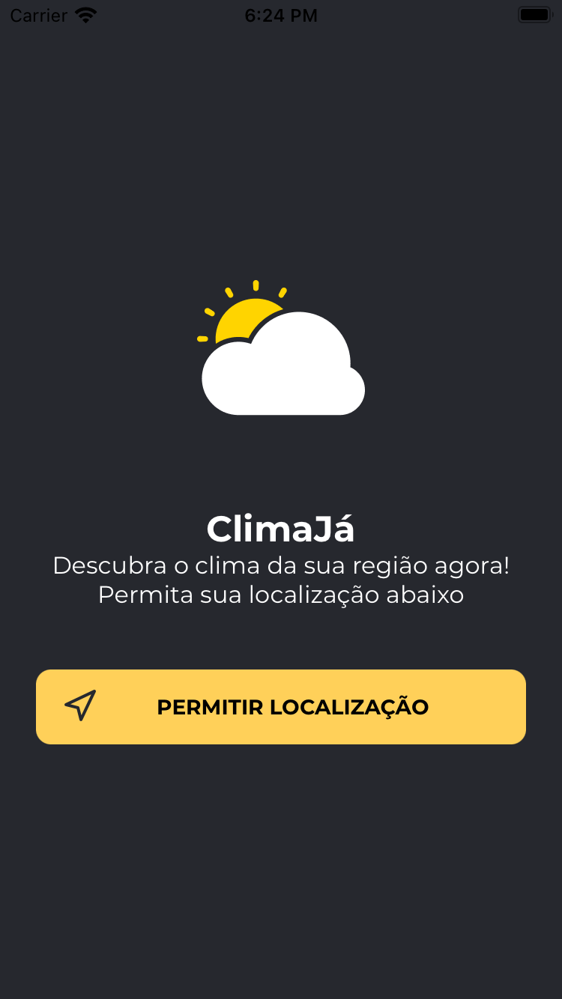

<h1 align="center">ClimaJá</h1>
  <p align="center">
    
  </p>

## Proposta
<p align="left">
   O ClimaJá é um aplicativo para analisar dados climatológicos da sua cidade, podendo analisar o dia atual e os outros 4 dias seguintes. Ele usa sua geolocalização para conseguir obter a cidade atual
</p>

<p align="center">
  <a href="https://github.com/lucasmontano">
    
  </a>
  
</p>

## Layout Exclusivo criado no figma
  <p align="left">
   Para melhorar mais ainda a experiência criamos um Interface de usuário exclusiva para esta aplicação
   [Clique aqui para acessar o UI criada](https://www.figma.com/file/OyVmXUVuFVAcb6j9njpGXv/Clima?node-id=0%3A1)
</p>

## Abaixo segue um print da aplicação React Native
<p align="center">
    
    
</p>

## Pré-Requisitos
* React Native 0.66.3

## Setup

### Clone

- Clone este repositório usando

```
git clone https://github.com/melieskubrick/climaja
```

- Após clonar o projeto por completo rode os comandos abaixo

```JAVASCRIPT
yarn
cd ios && pod install
```

Disponibilizamos no projeto um arquivo .env.example, copie este arquivo e renomeie para .env, logo após insira suas credenciais do [OPEN_WEATHER](https://openweathermap.org/api)
e do [MAPQUEST](https://developer.mapquest.com/documentation/)

## Libs Utilizadas
Aqui estão os pods que foram utilizados para a construção deste app! Estes pods agilizam e melhoram a performace da aplicação
* [react-native-geolocation-service](https://github.com/Agontuk/react-native-geolocation-service)
<br/>Esta lib permite que o app solicite a permissão de localização do usuario iOS/Android
* [react-native-dotenv](https://github.com/goatandsheep/react-native-dotenv)
<br/>Este plugin do babel permite injetar variáveis de ambiente no projeto usando o dotenv para vários ambientes.
* [date-fns](https://date-fns.org)
<br/>Esta lib é conjunto de ferramentas consistentes para a manipulação de datas
* [axios](https://github.com/axios/axios)
<br/>O Axios é um cliente HTTP baseado em Promises para fazer requisições


 <h2 align="center">
   Made with ♥
</h2>
